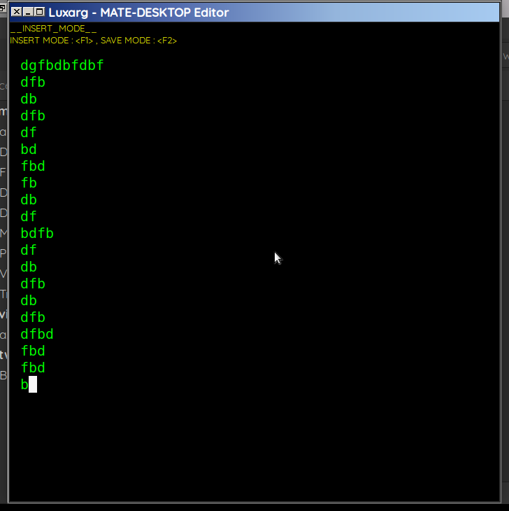

# luxarg :

LUXARG is the best SCI-FI project editor for MATE-DESKTOP, built with GJS (GNOME JavaScript).

This project is a remake using GJS for a futuristic, keyboard-friendly text editor.

Easy to use and user-friendly!

LUXARG supports GNOME and MATE desktops on Linux distributions.

# ICON

# screenshot :

# KEYS :
    INSERT MODE : <F1>
    SAVE   MODE : <F2>
    OPEN   MODE : <F3>
    STOP MODE   : <Escape>

# INSTALLATION
    Ensure GJS and GTK are installed:
    $ sudo apt install gjs libgtk-3-dev  # For Debian/Ubuntu
    $ sudo dnf install gjs gtk3-devel    # For Fedora
    $ sudo pacman -S gjs gtk3            # For Arch

    Run the editor:
    $ gjs main.js

# DEPENDENCIES
    - GJS (GNOME JavaScript)
    - GTK 3

# FEATURES
    - Sci-fi dark theme with neon green text
    - Keyboard-driven modes
    - File save and open dialogs
